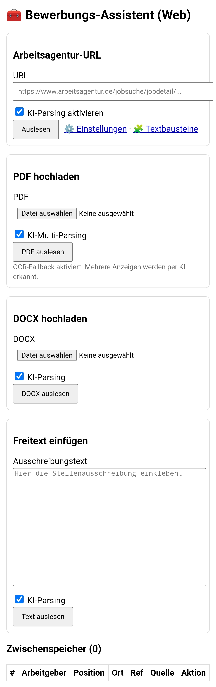

  

# ads2letter

**ads2letter** ist eine Webanwendung auf Basis von **Flask + Gunicorn**, die Bewerbungsanschreiben generiert und verwaltet.  
Seit August 2025 ist außerdem ein **Job-Crawler** integriert, der aktuelle Stellenanzeigen automatisch einliest und direkt in ads2letter nutzbar macht.

---

## Features

### 1. Anschreiben-Generator
- Erstellung von Bewerbungsanschreiben aus Basisdaten (`/coverletter`).
- Übergabe von Jobtitel, Firma, Ort direkt per URL-Parameter.
- Speichern in SQLite-Datenbank (`applications_all.db`).

### 2. Job-Crawler
- Eigener Unterordner `crawler/` mit Python-Skripten und Konfiguration.
- Läuft manuell (per Button im Frontend) oder automatisiert (Cronjob / systemd timer).
- Quellen: aktuell die **Bundesagentur für Arbeit** (inoffizielle JSON-Schnittstelle).
- Ergebnisse werden nach `crawler/out/jobs.json` geschrieben.
- Metadaten (Läufe, Fehler, Jobanzahl) werden zusätzlich in `applications_all.db` gespeichert.

### 3. Integration ins Web-Frontend
- Auf der Startseite von ads2letter eingebautes Widget mit:
  - Tabelle der aktuell gefundenen Jobs.
  - Button „↻ Jetzt aktualisieren“ (führt den Crawler sofort aus).
  - Direktlinks: „In Anschreiben übernehmen“ → öffnet das Coverletter-Formular mit vorausgefüllten Feldern.
  - Statusanzeige inkl. „Zuletzt aktualisiert am …“.

### 4. API
- `GET /api/jobs` → aktuelle Jobs (aus jobs.json).
- `POST /api/jobs/reload` → Crawler starten, Ergebnisse sofort laden.
- `GET /api/jobs/status` → letzter Lauf (aus SQLite), aktueller Count.

Optionale HTML-Seiten (nur bei aktivierten `enable_pages=True` in `register_crawler_routes`):
- `/jobs` → einfache Job-Tabelle im Browser.
- `/jobs/reload` → führt den Crawler aus, leitet zurück.

---

## 📸 Screenshots

  

